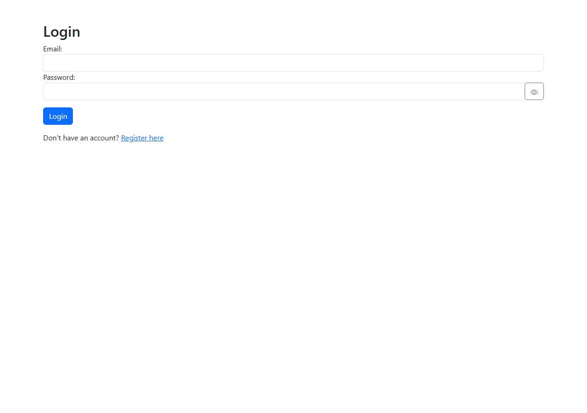
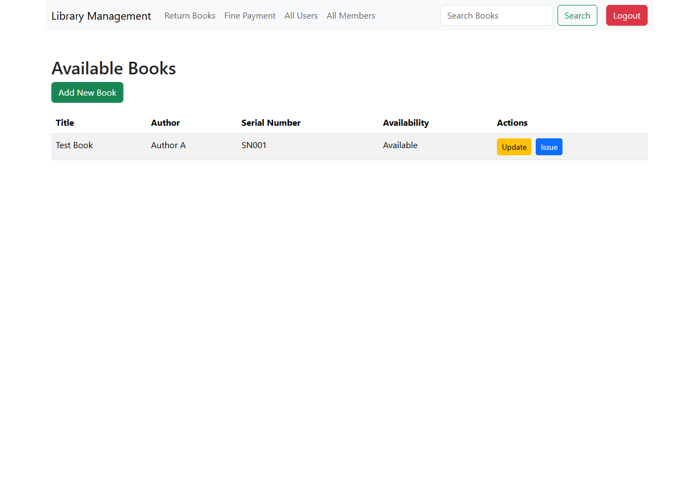
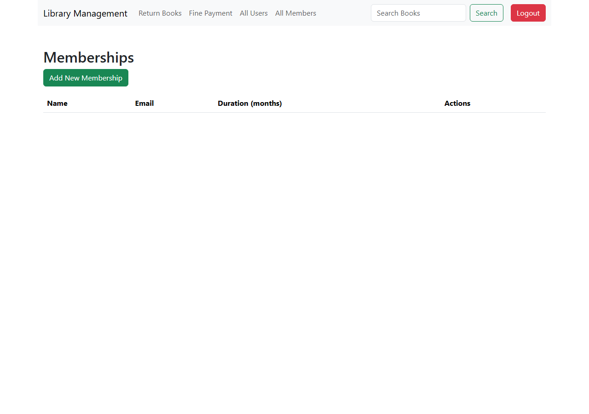

# Library Management System

A MERN app for managing a library's books, members, and checkouts — admins add/issue/return books, manage memberships, and track fines.

## Overview

An internal library-management tool: admins log in to add books, register memberships, issue and return books to members, and collect overdue fines. All management actions are restricted to admin accounts (enforced server-side).

## Features

- JWT-based login/registration with bcrypt-hashed passwords, admin vs. regular user roles
- Book catalog: add, update, search, issue, and return
- Membership management: add, update, delete
- Transaction tracking: issue/return dates, fine payment
- Admin-only user management (list, add, update, delete)

## Screenshots

| Login | Available Books |
|---|---|
|  |  |

| Memberships |
|---|
|  |

## Technology Stack

**Frontend:** React 18, React Router 6, Bootstrap, Axios
**Backend:** Node.js, Express, MongoDB (Mongoose), JWT, bcryptjs

## Local Installation

Requires Node.js 18+ and a MongoDB instance.

```bash
git clone https://github.com/Rockstar100/library_Management.git
cd library_Management
```

### Backend

```bash
cd backend
npm install
cp .env.example .env   # fill in MONGO_URI and JWT_SECRET
node server.js
```

### Frontend

```bash
npm install
npm start
```

Open [http://localhost:3000](http://localhost:3000), register an account with `role: "admin"` via the Register page or directly against `POST /api/auth/register`, then log in.

### Environment variables

**backend/.env**

| Variable | Description | Default |
|---|---|---|
| `PORT` | Port the API listens on | `5000` |
| `MONGO_URI` | MongoDB connection string | `mongodb://localhost:27017/libraryDB` |
| `JWT_SECRET` | Secret used to sign auth tokens | — (required) |

**frontend**

| Variable | Description | Default |
|---|---|---|
| `REACT_APP_API_URL` | Base URL of the backend API | `http://localhost:5000/api` |

## Available Commands

| Command | Description |
|---|---|
| `npm start` (root) | Run the React app in development mode |
| `npm run build` (root) | Build the React app for production |
| `node server.js` (backend) | Run the API |

## Project Structure

```
library_Management/
├── src/
│   ├── components/
│   │   ├── Auth/                # Login, Register
│   │   ├── Books/                 # BookList, AddBook, UpdateBook
│   │   ├── Membership/            # MembershipList, Add/UpdateMembership
│   │   ├── Transactions/          # IssueBook, ReturnBook, FinePay
│   │   └── UserManagement/        # UserList, Add/UpdateUser
│   └── axiosConfig.js            # shared axios client, attaches JWT
└── backend/
    ├── middleware/auth.js         # JWT verification + admin role guard
    ├── models/                     # Book, Membership, Transaction, User
    ├── routes/
    └── server.js
```

## API Reference

Routes marked "admin" require `Authorization: Bearer <token>` from an account with `role: "admin"`.

| Method | Route | Auth | Description |
|---|---|---|---|
| `POST` | `/api/auth/register` | — | Register an account |
| `POST` | `/api/auth/login` | — | Log in, returns a JWT |
| `GET` | `/api/books/search` | — | List/search books |
| `GET` | `/api/books/:id` | — | Get a book by ID |
| `POST` | `/api/books/add` | admin | Add a book |
| `PUT` | `/api/books/update/:id` | admin | Update a book |
| `POST` | `/api/books/issue` | admin | Issue a book to a member |
| `POST` | `/api/books/return` | admin | Return a book |
| `POST` | `/api/transaction/issue` / `/return` / `/pay-fine` | admin | Transaction lifecycle + fine payment |
| `GET`/`POST`/`PUT`/`DELETE` | `/api/memberships/*` | admin | Membership CRUD |
| `GET`/`POST`/`PUT`/`DELETE` | `/api/users/*` | admin | User management (passwords excluded from responses) |

## Deployment

Needs a persistent Node process and MongoDB — not GitHub Pages material. Recommended: [Render](https://render.com) or [Railway](https://railway.app) (Node web service) + [MongoDB Atlas](https://www.mongodb.com/atlas) free tier for the backend; Vercel/Netlify for the frontend. No live deployment has been set up for this repository.

## Known Limitations

- No self-service member accounts — memberships are managed entirely by admins; there's no member-facing login.
- No pagination on book/membership/user lists.

## Future Improvements

- Add member-facing accounts for self-service book search/history.
- Add pagination and filtering to list views.

## License

MIT — see [LICENSE](LICENSE).

## Author

**Parveen Jaiswal**
GitHub: [@Rockstar100](https://github.com/Rockstar100)
